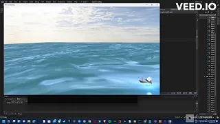

## Instructions for Users:

### For Users who downloaded the zip 

Please follow these steps to set up the project after downloading:

1. **Extract the ZIP file.**

2. **Navigate to the project root:**  
   This is where the initialization script is located.

3. **Run the appropriate script**
   (./fetch_submodules.sh for Unix-like systems or fetch_submodules.bat for Windows) to download and initialize the submodules.


**This will download and initialize the submodules for the project.**


### For Users who cloned the repo

**Navigate to the root directory (diretory with the src folder) and in console (git installed)**

``` git submodule update --init --recursive ```

### For all users after the above steps

**Open the project with Visual Studio(tested on VS2022) and run/save the CMakeLists.txt file (this should be automatic when you open with Visual Studio)**


## Demo
[](https://youtu.be/DXxmlrK-fiA?si=9z1eyJ1ijoSjMYIM)


## Application Controls

1. WASD to move camera.

2. Mouse/Touchpad to change camera orientation.

3. B Key to toggle WireFrame Mode

4. Arrow keys up/down to increase/decrease tessellation levels of the boats. 


